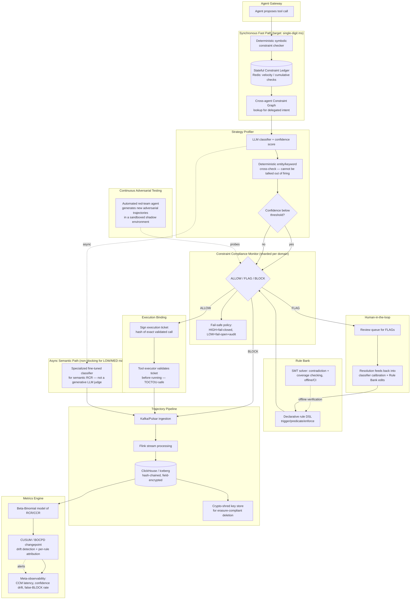

# Verifiable Observability — Flaw Analysis, Fixes & Novelty Roadmap

*A working document to take the project from "good idea" → "defensible published research" → "enterprise-grade system."*

---

## 0. Read This First (TL;DR)

**The single biggest risk to this project right now is not a technical flaw in your architecture — it's your literature survey being about 6 months out of date.** 2026 has produced a dense cluster of papers that overlap heavily with what you're building (rule DSLs, formal verification of agent policies, constraint drift, multi-agent delegation safety). If you submit without engaging with them, a reviewer who works in this space will reject on "missing highly relevant related work" alone, regardless of how good your system is. **Part 1 fixes this — read it before anything else.**

After that, the architecture in your PDF is a solid *skeleton* — the four-stage loop (Profiler → Rule Bank → CCM → Metrics/Store) is the right shape. But it currently has real gaps in five areas: **correctness/security** (a clever agent or a race condition can slip past it), **statistics** (your drift detector will cry wolf or miss real drift), **privacy law** (your "store everything forever" plan is illegal in the domains you're targeting), **scale** (SQLite and synchronous checks will not survive "astronomical" traffic), and **honesty of scope** (nothing here yet measures the cost your guardrails impose on the agent's ability to do its job — which the literature calls the "verifier tax," and it's often the actual finding a paper gets remembered for).

None of this is a reason to abandon the idea — it's a very good idea, aimed at a real gap. This document tells you exactly what to fix, how, and what's genuinely still yours to claim as novel once the dust settles.

---

## Part 1 — Urgent: Your Literature Survey Has a Gap (Read This Before Writing Another Line of Code)

Your current survey (ReAct → AgentBench → ToolEmu → AgentDojo → τ-bench → AgentOps → ASB → Wang et al. 2026 MCP) is a good foundation, but it stops at a specific sub-genre (benchmarking + one runtime-enforcement paper). In 2026, a second wave of papers went directly after **runtime enforcement, formal verification, and drift** — which is exactly your territory. You need to read and cite these before you can credibly claim novelty.

### 1.1 Papers you must add

| Paper | Venue/Year | What it does | Why it matters to *you* |
|---|---|---|---|
| **AgentSpec** (Wang, Poskitt, Sun) | ICSE 2026 | A lightweight DSL where rules are `(trigger, predicate, enforcement)` triples; auto-generates rules with an LLM (95.6% precision / 71% recall on embodied-agent risk); overhead in milliseconds; tested on code agents, embodied agents, autonomous driving | **This is your Rule Bank, already built, in a different domain set.** If your Rule Bank stays "prose SOPs graded by an LLM," a reviewer will ask "why not AgentSpec?" You need to either adopt a similar triple-structure DSL or explicitly argue why finance/healthcare SOPs need something AgentSpec's predicate language can't express (e.g., stateful/cumulative predicates — see §2.4) |
| **Pro²Guard** (Wang et al.) | 2025/2026 | Proactive enforcement via **probabilistic model checking** — looks ahead across a trajectory instead of judging one action at a time | Directly relevant to your "drift" ambitions; model checking is a much stronger tool than OLS trend-fitting for reasoning about multi-step risk |
| **VeriGuard** | ICLR 2026 (under review / OpenReview) | Formally verifies generated *policy code* against a Hoare-triple contract (`{Pre} policy {Post}`) via a validate → test → formally-verify pipeline | Overlaps with any plan you have to "formally verify the Rule Bank." VeriGuard verifies the *enforcement code*, not consistency *between* rules — that gap is still open (see §3.4) |
| **Shield-Agent** (Chen et al.) | 2025/2026 | Converts external regulations/platform policies into "logical rule circuits" for action-level safety reasoning | This is almost exactly "turn HIPAA/finance SOPs into enforceable rules." Cite it as the closest regulatory-to-rule pipeline and explain what you do differently |
| **AgentLTL** | 2026 | A trace-verification framework that measures, enforces, and *trains* "procedural compliance" in tool-using agents, apparently using temporal-logic-style trace checking | **This is the closest existing thing to your RCR metric.** You must read this paper closely and state precisely how RCR differs from their procedural-compliance measure — right now they look like the same idea with a different name |
| **Safe Bilevel Delegation (SBD)** | 2026 | A formal framework specifically for **runtime delegation safety in multi-agent systems** | This is your "cross-agent constraint propagation" idea (§3.3), already formalized. Cite it; differentiate by tying delegation safety to your CCR/velocity-ledger mechanism |
| **"Constraint Drift" — Li et al., "Safe Multi-Agent Behavior Must Be Maintained, Not Merely Asserted"** | arXiv 2605.10481, May 2026 | Names the exact phenomenon of constraints weakening as they pass through memory, delegation, tools, and audit; proposes "Constraint State Governance" — constraints as explicit, signed, inherited execution state | **You cannot use the word "drift" for constraint weakening without citing this paper — it coined the term for almost exactly your idea.** Your RCR/CCR trend-decline hypothesis is a specific instance of their broader claim; frame your work as an operationalization of Constraint State Governance with concrete metrics |
| **"Agent Drift" (Rath)** | arXiv 2601.04170, Jan 2026 | A separate, earlier paper that also coined "drift" for behavioral degradation in multi-agent LLM systems (semantic/coordination/behavioral drift) | A second paper using "drift" terminology before you — reinforces that you need a related-work paragraph specifically about drift terminology, and ideally a name for your metric that doesn't collide with either |
| **"Toward Safe LLM Agents" (Dantas et al.)** | arXiv 2608.14590, June 2026 | A PRISMA systematic review of 38 studies (2022–2026). Key findings: (a) natural-language-to-formal-rule translation only reaches 24–35% semantic correctness — the **"specification bottleneck"**; (b) runtime monitoring is the most mature enforcement strategy, cutting unsafe actions 40–65%, but gives no complete guarantee; (c) the **"verifier tax"**: blocking 94% of unsafe actions can still leave under 5% safe task completion, because agents route around the block into other unsafe paths; (d) no system yet achieves soundness + scale + semantic correctness + task-preservation together | **This survey should anchor your whole introduction.** The "verifier tax" finding in particular is the single most important thing missing from your project overview — see §2.7 |
| **"Fundamental Limits of Runtime Policy Enforcement in Multi-Agent AGI Systems" (Shukla & Joshi)** | AGI 2026 (Springer LNAI) | Formal impossibility results: runtime enforcement provably *cannot* guarantee safety over unbounded futures, cannot fully verify semantic code behavior, and cannot solve certain coordination structures | Use this to scope your claims honestly — don't claim your CCM "guarantees" compliance; claim it "enforces checkable constraints within a bounded horizon," which is what's actually achievable and defensible |
| **"Position: A Three-Layer Probabilistic Assume-Guarantee Architecture..."** | arXiv 2605.18672, May 2026 | Formal argument that single-layer safety enforcement is *structurally* inadequate for safety-critical LLM agents; proposes composable, layered assume-guarantee contracts | This is strong theoretical backing for the "hybrid symbolic + statistical + semantic" layered CCM design recommended in §3.1 — cite it as your architectural justification |
| **Progent** (Shi et al.) | 2025 | Programmable, fine-grained privilege control with dynamic policy updates and explicit **fallback behaviors** | Cite for your fail-open/fail-closed design (§2.3) — they already formalize "what happens when a policy can't decide" |
| **GuardAgent / TrustAgent / Safiron** | 2024–2026 | External guard-agent models that generate runtime checks (GuardAgent), constitution-guided multi-stage checking (TrustAgent), and a trained guardian model that detects/categorizes/explains risky trajectories pre-execution (Safiron) | Relevant prior art for your Strategy Profiler; Safiron in particular is close to "risk-tier classification with explanation" |
| **Winston, Winston & Just, "Solver-aided verification of policy compliance in tool-augmented LLM agents"** | arXiv 2603.20449, 2026 | Uses an SMT solver to verify policy compliance | This is the paper to cite (and differentiate from) if you build the "prove no two rules contradict" idea in §3.4 |
| **Costa & Köpf, "Securing AI Agents with Information-Flow Control"** | arXiv 2505.23643, 2025 | Taint-tracking / information-flow labels on data moving through an agent, not just discrete tool-call checks | Exposes a real hole in your architecture — see §2.6 |

### 1.2 What to do with this list

1. Add all of these to your literature survey table in the same format you already used.
2. In your Research Gap section, change the claim from *"no framework combines these things"* to a sharper, still-true claim: *"no framework combines (a) trajectory-level quantitative compliance metrics with statistically grounded drift detection, (b) cryptographically verifiable — not just logged — enforcement, and (c) a single deployable design validated across finance, healthcare, and code execution."* That claim survives contact with everything above; your current, broader claim does not.
3. Do this **before** running more experiments — it changes what's worth measuring (see §7).

---

## Part 2 — Flaws in the Current Architecture, and How to Fix Each

Each entry: plain-English version first, then the technical detail, then the fix.

### 2.1 The judge and the defendant are the same kind of witness (LLM-grades-LLM circularity)

**Plain English:** If you use an LLM to check whether another LLM behaved correctly, you haven't verified anything — you've just asked a second unreliable witness to vouch for the first one. It can be fooled by the same tricks (prompt injection, hallucination) that fool the agent it's grading.

**Technical detail:** RCR, as described, appears to be produced by grading the agent's reasoning trace against a rule using another LLM call. That judge has no formal guarantees, is itself jailbreakable, and its "score" is not something you can mathematically defend — which undercuts the word "Verifiable" in your project's name.

**Fix:**
- Split every rule into (a) **symbolic/deterministic** predicates wherever possible — dollar thresholds, presence/absence of a prior step in the trajectory, whether a required field exists — evaluated with plain code, not an LLM. This is most of what your Finance and Code examples actually need.
- For the residual truly-semantic rules (e.g., "did the agent's tone match bedside-manner policy"), use a **small, specialized, fine-tuned classifier** trained and evaluated on a labeled dataset (report precision/recall like AgentSpec did), not a general-purpose generative LLM judge. It's cheaper, faster, and — critically — its error rate is a number you can report and defend in a paper.
- Never let a semantic LLM judgment alone justify a hard BLOCK on a HIGH-risk action; reserve it for FLAG (human review), and let only deterministic checks or the human queue issue hard blocks on the riskiest tier.

### 2.2 Nothing stops the executed action from being different from the checked action (TOCTOU)

**Plain English:** Your system checks a proposed action and says "OK, go ahead" — but nothing physically ties that approval to the exact action that actually runs. Under concurrency or a bug, the agent could swap in a bigger transfer after the check passed.

**Technical detail:** This is a classic time-of-check-to-time-of-use (TOCTOU) vulnerability, and it is completely unaddressed in the PDF. At "astronomical" async scale this is not a theoretical concern — race conditions get common at volume.

**Fix — this is also your strongest novelty candidate (see §3.1):**
- At check time, compute a canonical hash over the normalized action (tool name + parameters + trajectory ID + monotonic sequence number).
- Issue a short-TTL, signed **"execution ticket"** (HMAC or Ed25519) bound to that exact hash.
- The tool executor must present and validate the ticket immediately before running; any mismatch (different params, expired ticket, reused ticket) is an automatic BLOCK plus an incident log entry.
- This is what turns "the CCM said ALLOW" into a cryptographically checkable fact instead of a line in a log that you're trusting after the fact.

### 2.3 No answer to "what happens when the safety system itself goes down?"

**Plain English:** Your document never says whether the system fails safe (blocks everything if it can't check) or fails open (lets everything through if it can't check). At real scale, your checker *will* go down sometimes — you need to have already decided what happens.

**Technical detail:** Silent fail-open defeats the entire safety proposition; blanket fail-closed makes the system unusable during any outage. This needs to be an explicit, tested, configurable policy — not an accident of whatever the code happens to do when a call times out.

**Fix:**
- Make fail-safe behavior a first-class, risk-tier-aware setting: **HIGH risk → fail-closed** (block on CCM unavailability); **LOW risk → fail-open** with mandatory async post-hoc audit and alerting; **MEDIUM → fail-closed with fast escalation** to a human queue.
- Test this deliberately with chaos-engineering-style fault injection (kill the CCM mid-flight in a staging environment and confirm the configured behavior actually happens). Cite **Progent** (§1.1) — they already formalize fallback behaviors for exactly this scenario.

### 2.4 An attacker (or a bored agent) can stay under every limit by splitting the action ("salami slicing")

**Plain English:** Your $50,000 transfer block is easy to walk around with ten $4,999 transfers. Nothing in your design remembers what happened five minutes ago.

**Technical detail:** The CCM as described appears to evaluate each tool call independently with no memory of prior calls in the same session/account/counterparty window. This is a well-known fraud vector (velocity checks exist in every real payments system for exactly this reason) and it's currently invisible to your architecture.

**Fix:**
- Add a **Stateful Constraint Ledger**: a per-entity (account/session/agent/counterparty) rolling-window aggregator, backed by a fast store (Redis or similar), that the CCM consults *in addition to* the single-call check — e.g., "sum of transfers to this counterparty in the trailing 24 hours."
- This generalizes beyond finance: in healthcare, it's "how many PHI record accesses by this agent in the last hour"; in code execution, it's "how many privilege-escalation attempts in this session."

### 2.5 A blocked agent can just ask a different agent to do it (multi-agent delegation)

**Plain English:** If Agent A is blocked from doing something, nothing currently stops it from asking Agent B to do it instead — especially if B is on a different trajectory or CCM instance.

**Technical detail:** Real enterprise deployments increasingly use agent swarms and sub-agent delegation. A per-agent-trajectory CCM has no visibility into delegated intent.

**Fix:** A shared, org-wide **Constraint Graph** keyed by the underlying entity/action (not just by agent trajectory), so a delegated task inherits the parent task's constraint state. This is close to what **Safe Bilevel Delegation** (§1.1) already formalizes — read it, adapt it, cite it.

### 2.6 The CCM checks the destination, not where the data came from (no information-flow tracking)

**Plain English:** Your system currently asks "is this specific tool call OK?" It never asks "did the information inside this tool call come from somewhere it shouldn't have?" A poisoned document or an indirect prompt injection can smuggle a harmful instruction into an otherwise-innocent-looking call.

**Technical detail:** This is the exact class of failure that source-to-sink / provenance-aware guardrail research addresses — inspecting only the final tool call misses dependencies where untrusted external content influenced the arguments. Notably, the MCP paper *you already cited* (Wang et al. 2026) includes a `LabelTracker` for this reason — your own architecture doesn't yet have an equivalent.

**Fix:** Add lightweight information-flow labels (taint tags) that follow data from ingestion (email, retrieved documents, tool outputs) through to tool-call arguments; the CCM should be able to say "this parameter traces back to untrusted external content" as an input to its ALLOW/FLAG/BLOCK decision, independent of what the parameter's face value looks like. Cite Costa & Köpf (§1.1) as the technique to adapt.

### 2.7 Nobody is measuring what your guardrails cost the agent (the "verifier tax")

**Plain English:** A guardrail that blocks 100% of bad actions but also makes the agent unable to do 95% of its actual job is not a success — it's a system nobody would deploy. Your current write-up never reports this trade-off.

**Technical detail:** This is precisely the "verifier tax" finding from the PRISMA survey in §1.1: aggressive blocking can crater task completion because agents route around blocks into other unsafe paths, or simply can't finish the task at all. Without measuring this, your paper reports safety numbers that reviewers will (correctly) suspect are hiding a system that's technically safe but practically useless.

**Fix:** Every experiment must report a **paired metric**: safety improvement (attack success rate reduction, CCR) *and* task-completion / false-BLOCK rate on a benign task set, ideally as a Pareto frontier across different strictness settings rather than a single operating point. This single addition will likely be the most memorable empirical contribution in your paper — more than the architecture diagram.

### 2.8 The drift detector uses the wrong statistics

**Plain English:** You're proposing to fit a straight line (OLS) through compliance scores to detect when an agent is getting worse. That's like trying to detect a pothole by checking if the road is tilted overall — it misses sudden drops, gets thrown off by one bad turn, and can't tell you *when* things actually started going wrong.

**Technical detail:** OLS assumes a linear trend, independent/homoscedastic errors, and is highly sensitive to outliers — none of which holds for a bounded ratio metric (RCR, CCR ∈ [0,1]) that's autocorrelated over consecutive turns. A single very bad turn skews the whole-window regression; a genuine step-change (sudden drift) produces a weak, easily-missed slope when averaged with the stable period before it; and OLS gives no localized "drift started here" answer.

**Fix:**
- Model RCR/CCR turn-outcomes as **Beta-Binomial**, not Gaussian residuals around a line.
- Use a proper **changepoint** method — CUSUM or Bayesian Online Changepoint Detection (BOCPD) — to answer "did something change, and exactly when," with a confidence interval.
- Combine with an **EWMA** for smoothed real-time monitoring between changepoint checks.
- Add **drift attribution**: decompose the metric by rule-ID and tool-ID before aggregating, so an alert comes with "compliance with the allergy-check rule dropped from 98%→61% over the last 200 turns," not just "RCR is down." This turns an alert into something an engineer can act on — and it's a clean, publishable empirical result on its own (see §3.2).

### 2.9 Risk-tier classification is a single, overconfident guess

**Plain English:** One model call decides LOW/MEDIUM/HIGH with no sense of how sure it is. A borderline task that gets misclassified as LOW silently skips every protection meant for HIGH-risk actions.

**Fix:** Have the Strategy Profiler output a calibrated confidence alongside the tier (temperature-scaled softmax, or majority vote across an ensemble of classifiers). Default to **escalate-on-uncertainty**: below a confidence threshold, treat the task as the *higher* tier until confirmed. Cross-check the LLM classifier's tier against cheap deterministic signals (regex/entity extraction for dollar amounts, medication names, `sudo`/shell patterns) that can't be talked out of firing regardless of how the LLM interprets intent — this also mitigates prompt injection aimed at the Profiler itself.

### 2.10 Rules are prose, so nobody can prove they don't contradict each other

**Plain English:** If your Standard Operating Procedures are just paragraphs of English, there's no way to check "do any two of these rules disagree with each other for the same situation" — except by manually re-reading all of them every time you add a new one, which doesn't scale and isn't something you can put in a paper as a guarantee.

**Fix:** Express rules in a small declarative structure (adopt something in the spirit of AgentSpec's `trigger, predicate, enforcement` triples, or a small Datalog-style subset), then run **SMT-solver-based consistency checking** (Z3) over the rule set to detect contradictions and coverage gaps before deployment. Cite AgentSpec, VeriGuard, and Winston et al.'s solver-aided verification (§1.1) as prior art, and be explicit that your contribution is applying this to *cross-domain regulatory SOPs* (finance/healthcare) rather than code/embodied/AV predicates, which is a real, defensible difference in scope.

### 2.11 "Store every thought and action permanently" is illegal in the domains you're targeting

**Plain English:** GDPR and similar laws give people a right to have their data deleted. A healthcare or finance audit trail that stores everything forever, in a database that isn't even properly access-controlled, is itself a liability — especially if that database ever leaks.

**Technical detail:** Permanent storage of raw agent trajectories (including PHI, in the Healthcare domain) directly conflicts with data-minimization and right-to-erasure principles, and an unencrypted SQLite audit trail is itself a new attack surface for exactly the sensitive data the system exists to protect.

**Fix:**
- **Field-level encryption** of sensitive payloads with per-record keys.
- **Crypto-shredding** for "deletion": destroy the per-record key (not the hash-chain entry itself), so the audit trail's *integrity* survives (you can still prove "an action happened and was checked here") while the *content* becomes permanently unreadable. This is the one design choice that reconciles immutability (needed for verifiability) with erasure rights (needed for compliance) — write this down explicitly in your paper, it's a real, citable design decision.
- Redact/tokenize PHI before it ever reaches long-term storage; keep only the rule-relevant derived features needed for RCR/CCR computation.

### 2.12 SQLite cannot survive contact with "astronomical" scale

**Plain English:** SQLite is a single file on a single machine, with one writer at a time. That's fine for a prototype. It is not what you use if Google is running this across millions of agent calls a day.

**Fix:** Ingest via an append-only log (Kafka or Pulsar) → stream processing for real-time metrics (Flink) → columnar OLAP storage for cheap long-term queryable audit history (ClickHouse, or Apache Iceberg/Delta Lake on object storage). Apply the hash-chaining/Merkle layer at the log level so tamper-evidence survives the migration off SQLite. Keep SQLite (or Postgres) for your prototype and early experiments — just don't describe it as the enterprise-scale answer in the paper.

### 2.13 No caching, no async path — every call pays the full latency cost

**Fix:** Run deterministic symbolic checks synchronously (they're microsecond-scale and cheap); make heavier semantic scoring asynchronous/post-hoc for LOW/MEDIUM risk, reserving the synchronous hard-block path for HIGH-risk actions only. Memoize CCM decisions for identical or near-duplicate (task-type, parameter-bucket) calls with a short TTL.

### 2.14 The safety system has no dashboard of its own health

**Fix:** Meta-observability: track CCM decision latency, Profiler confidence distribution over time, and estimated false-BLOCK / false-ALLOW rates (fed by the human-review outcomes in §2.15). If the safety layer silently degrades, you want to know before an incident, not after.

### 2.15 Human reviews of FLAGs go nowhere

**Plain English:** Someone reviews a flagged action and decides "approve" or "deny" — and then what? If that decision doesn't feed back into the system, you'll keep generating the same false alarms forever, and the Rule Bank never actually improves.

**Fix:** Record every human resolution (approve/deny + rationale) as labeled data that feeds back into (a) classifier calibration and (b) proposed Rule Bank edits. This is also a real governance point worth citing in the paper — the EU AI Act's human-oversight requirements for high-risk AI systems are satisfied much more convincingly by a documented feedback loop than by an undocumented human-in-the-loop step.

### 2.16 Metric naming is inconsistent between your two documents

Your PDF calls it **"Rule Compliance Rate (RCR)"**; your literature survey calls the same acronym **"Reasoning Consistency Ratio (RCR)."** Pick one name, and — more importantly — give it a precise formal definition (exact numerator/denominator, what counts as "compliant," whether it's per-turn or per-trajectory) before your next draft. A reviewer will flag this inconsistency in the first read-through, and it's a five-minute fix.

---

## Part 3 — What's Genuinely Still Novel (After Accounting for Part 1)

Being honest about the crowded landscape in Part 1 actually *sharpens* your pitch rather than killing it. Here's what appears to still be open:

### 3.1 Cryptographically verifiable enforcement, not just logged enforcement

Everything surveyed (Wang et al.'s "tamper-evident AuditLogger" included) describes *logging* decisions for later audit. None of it appears to cryptographically **bind the checked action to the executed action** at the moment of execution (the TOCTOU fix in §2.2) using a signed, hash-scoped execution ticket. This is the one piece of your architecture that would make the word "Verifiable" in your project's name literally, mathematically true — right now it describes an aspiration more than a mechanism. This is worth building and worth a dedicated section of the paper.

### 3.2 Statistically rigorous, attributable drift detection, applied to a concrete quantitative metric

"Constraint Drift" and "Agent Drift" (§1.1) are conceptual/theoretical framings. Neither, as far as your survey shows, pairs a changepoint-detection method (BOCPD/CUSUM over a Beta-Binomial model) with a concrete, per-turn, per-rule-decomposed compliance metric and reports drift-detection precision/recall on synthetically injected drift. Turning "constraint drift" from a concept into a **measured, attributable, statistically validated signal** is a legitimate empirical contribution.

### 3.3 A working, cross-domain (finance + healthcare + code) reference implementation with a shared architecture

Most of the closely related systems specialize: AgentSpec covers code/embodied/AV; Shield-Agent targets general regulation-to-rule translation; the MCP paper targets tool-call security. A rigorously evaluated system that runs the *same* CCM/Profiler/Metrics core across finance, healthcare, and code — with real domain-specific SOPs, not toy examples — is still a meaningful, citable engineering contribution, provided the evaluation is real (see Part 7) and not just three demo scripts.

### 3.4 Privacy-preserving, erasure-compliant verifiable audit for regulated data

The crypto-shredding design in §2.11 — reconciling immutable, hash-chained audit trails with GDPR/CCPA-style erasure rights — does not appear addressed in anything surveyed. This is a small, concrete, buildable contribution that directly matters for your Healthcare domain claim.

### 3.5 The safety–utility Pareto frontier as a first-class, reported result

Very little of the surveyed work reports the "verifier tax" trade-off as a headline result rather than a caveat in the discussion section. Explicitly designing your evaluation around a **safety vs. task-completion Pareto curve** (varying CCM strictness) — rather than a single safety number — would be a genuinely useful, differentiated empirical framing, and directly answers the PRISMA survey's central open question.

### What to *stop* claiming as novel

- A rule DSL, by itself (AgentSpec already exists — differentiate by domain and by adding the stateful/velocity predicates in §2.4, not by claiming the DSL idea itself).
- "Drift detection" as a bare concept (already named and framed twice in 2026 — your contribution is the *statistics* and the *metric*, not the word).
- Formal verification of rule/policy code in the abstract (VeriGuard and Winston et al. are already there — your angle is cross-rule consistency for natural-language-derived regulatory SOPs specifically).
- Multi-agent delegation safety as a bare concept (Safe Bilevel Delegation already formalizes this — your angle is tying it to the concrete velocity-ledger/CCR mechanism).

---

## Part 4 — Revised Enterprise Architecture



**Why this shape:** the fast, cheap, deterministic checks run synchronously in the hot path (keeping "astronomical" throughput realistic); the expensive semantic judgment is decoupled and runs async wherever risk tier allows; the execution ticket makes ALLOW cryptographically binding instead of advisory; the stateful ledger and constraint graph catch the two attack patterns (§2.4, §2.5) that a stateless, per-call CCM structurally cannot; and the metrics/store layer is designed to be both tamper-evident *and* legally erasable, which most audit-log designs treat as mutually exclusive.

---

## Part 5 — A Realistic Build Roadmap

A note on scope before the phases: **"enterprise-ready, astronomical scale" is a product pitch, not a paper claim.** For a UROP-scale project, you cannot literally stand up and load-test a real Kafka/Flink/ClickHouse cluster under production traffic — and you don't need to. What you *can* do, and what a paper actually needs, is: (a) a working prototype of the algorithmic core (symbolic checks, execution tickets, drift detection), (b) a rigorous evaluation against existing benchmarks and baselines, and (c) an *analytical* or small-scale *load-tested* argument for how the design scales (Big-O reasoning, or a benchmark at, say, 10k–100k simulated calls, extrapolated with a clearly stated model). Reviewers accept "we argue this scales because X, and demonstrate it at Y scale" far more readily than an unsubstantiated "enterprise-ready" claim.

| Phase | Goal | Key deliverables |
|---|---|---|
| **0 — Foundations** | Fix the paper-blocking issues before writing more code | Resolve RCR naming (§2.16); add the Part 1 literature; formally define RCR/CCR with exact numerator/denominator |
| **1 — Symbolic core (single domain)** | Prove the deterministic fast path works | Symbolic CCM for Finance only; fail-safe policy (§2.3) implemented and chaos-tested; signed execution tickets (§2.2) |
| **2 — Statefulness** | Close the two structural gaps | Stateful Constraint Ledger (§2.4); uncertainty-aware Strategy Profiler with deterministic cross-checks (§2.9) |
| **3 — Metrics engine v2** | Replace OLS, add explainability | Beta-Binomial + CUSUM/BOCPD drift detector (§2.8) with per-rule attribution; validate against synthetically injected drift with reported precision/recall |
| **4 — Cross-domain extension** | Generalize the core | Add Healthcare and Code Execution rule sets through the same DSL/CCM core; crypto-shredding + field encryption for PHI (§2.11) |
| **5 — Scale argument** | Make the "enterprise" claim defensible | Small-to-medium load test (10k–100k calls) with latency/throughput numbers; Kafka/Flink/ClickHouse design described and, if feasible, prototyped at reduced scale; explicit statement of the extrapolation model used beyond that |
| **6 — Adversarial hardening** | Close the security gaps | Information-flow tagging (§2.6); automated red-team loop (§3, continuous testing) generating a held-out attack set distinct from your design-time Behavioral Regimes |
| **7 — Evaluation & writeup** | Publication-ready results | Full evaluation per Part 7 below; safety–utility Pareto curve (§3.5) as a headline figure |

---

## Part 6 — Quick-Reference Flaw Table

| # | Flaw | Category | Severity | One-line fix |
|---|---|---|---|---|
| 2.1 | LLM grades LLM (RCR circularity) | Correctness | Critical | Deterministic checks + small specialized classifier, not a generative judge |
| 2.2 | TOCTOU gap | Security | Critical | Signed, hash-bound execution tickets |
| 2.3 | No fail-open/fail-closed policy | Architecture | Critical | Risk-tier-aware explicit fail-safe policy, chaos-tested |
| 2.4 | Salami-slicing bypass | Security | Critical | Stateful Constraint Ledger (velocity checks) |
| 2.5 | Cross-agent delegation bypass | Security | High | Org-wide Constraint Graph |
| 2.6 | No information-flow tracking | Security | High | Taint-label tracking on tool-call arguments |
| 2.7 | No safety-utility tradeoff measured | Evaluation | Critical | Report Pareto frontier, not a single safety number |
| 2.8 | OLS drift detection | Statistics | High | Beta-Binomial + CUSUM/BOCPD + attribution |
| 2.9 | Overconfident risk tiering | Correctness | Medium | Confidence scores + escalate-on-uncertainty |
| 2.10 | Prose rules, no consistency proof | Architecture | Medium | Declarative DSL + SMT solver checking |
| 2.11 | Permanent storage violates privacy law | Compliance | Critical | Field encryption + crypto-shredding |
| 2.12 | SQLite can't scale | Scalability | High | Kafka/Flink/ClickHouse pipeline |
| 2.13 | No caching/async path | Scalability | Medium | Sync symbolic / async semantic split |
| 2.14 | No meta-observability | Operations | Medium | Dashboard on the safety system's own health |
| 2.15 | Human review has no feedback loop | Governance | Medium | Record resolutions, feed back into calibration |
| 2.16 | RCR named differently in two docs | Writing | Low (fix now) | Pick one name, define precisely |

---

## Part 7 — Evaluation Plan for Publication

- **Baselines:** no-guardrail agent; a general guardrail tool (Guardrails.ai or NeMo Guardrails) as an off-the-shelf comparison; AgentSpec (reimplemented or run on overlapping tasks where possible); Wang et al.'s MCP Policy Enforcement Point (reported numbers, cited comparison if reimplementation isn't feasible).
- **Test corpora:** AgentDojo (629 security test cases) and ASB for adversarial coverage; τ-bench-style long-horizon tasks for behavioral consistency; your own Behavioral Regimes for domain-specific SOPs — but treat these as **design-time** data only, and hold out a fresh, automatically-generated red-team set (§3, Phase 6) as your true test set, since a static hand-written eval set will be overfit to by construction.
- **Metrics:** RCR and CCR (once precisely defined, §2.16); attack success rate; false-BLOCK rate on a benign task set; the safety–utility Pareto frontier (§2.7/§3.5); added latency (p50/p99) and throughput under load; drift-detection precision/recall against synthetically injected degradation.
- **Statistical rigor:** multiple seeds, confidence intervals on every headline number, paired bootstrap significance tests when comparing against baselines — the PRISMA survey's core critique of the field is thin statistical reporting; don't repeat it.

---

## Part 8 — References to Add to Your Literature Survey

```
[9]  H. Wang, C. M. Poskitt, and J. Sun, "AgentSpec: Customizable Runtime
     Enforcement for Safe and Reliable LLM Agents," Proceedings of the
     48th IEEE/ACM International Conference on Software Engineering
     (ICSE), 2026.

[10] H. Wang, C. M. Poskitt, J. Sun, and J. Wei, "Pro²Guard: Proactive
     Runtime Enforcement of LLM Agent Safety via Probabilistic Model
     Checking," arXiv:2508.00500, 2025.

[11] "VeriGuard: Enhancing LLM Agent Safety via Verified Code
     Generation," under review, ICLR 2026 (OpenReview).

[12] "Shield-Agent: Policy-Grounded Runtime Verification for LLM
     Agents," 2025/2026.

[13] "AgentLTL: A Trace-Verification Framework for Measuring,
     Enforcing, and Training Procedural Compliance in Tool-Using LLM
     Agents," arXiv:2607.02599, 2026.

[14] "Safe Bilevel Delegation (SBD): A Formal Framework for Runtime
     Delegation Safety in Multi-Agent Systems," 2026.

[15] T. Li et al., "Safe Multi-Agent Behavior Must Be Maintained, Not
     Merely Asserted: Constraint Drift in LLM-Based Multi-Agent
     Systems," arXiv:2605.10481, 2026.

[16] A. Rath, "Agent Drift: Quantifying Behavioral Degradation in
     Multi-Agent LLM Systems Over Extended Interactions,"
     arXiv:2601.04170, 2026.

[17] P. Dantas et al., "Toward Safe LLM Agents: A Survey of
     Specification, Verification, and Enforcement," arXiv:2608.14590,
     2026.

[18] S. Shukla and H. Joshi, "Fundamental Limits of Runtime Policy
     Enforcement in Multi-Agent AGI Systems," Proceedings of the
     International Conference on Artificial General Intelligence
     (AGI), Lecture Notes in Computer Science vol. 16855, 2026.

[19] "Position: A Three-Layer Probabilistic Assume-Guarantee
     Architecture Is Structurally Required for Safe LLM Agent
     Deployment," arXiv:2605.18672, 2026.

[20] Y. Shi et al., "Progent: Programmable Privilege Control for LLM
     Agents," 2025.

[21] Z. Xiang et al., "GuardAgent: Safeguarding LLM Agents via Guard
     Agents," 2024.

[22] W. Hua et al., "TrustAgent: Towards Safe and Trustworthy LLM-based
     Agents through Agent Constitution," 2024.

[23] "Safiron: Planning-Stage Trajectory Guarding for LLM Agents,"
     2026.

[24] C. Winston, C. Winston, and R. Just, "Solver-Aided Verification of
     Policy Compliance in Tool-Augmented LLM Agents,"
     arXiv:2603.20449, 2026.

[25] M. Costa and B. Köpf, "Securing AI Agents with Information-Flow
     Control," arXiv:2505.23643, 2025.
```

*(Verify exact author lists, venues, and page numbers against the original sources before submission — some of the above were retrieved from abstracts/preprint listings and details such as final venue or co-author order may have changed between preprint and camera-ready versions.)*

---

## Closing Note

The core instinct behind this project — that "observability" without enforcement is not enough, and that enforcement without a mathematically checkable trail is not "verifiable" — is a genuinely good one, and it's still short of fully solved even after the literature catch-up in Part 1. The fastest path from here to a strong paper is: fix the six critical-severity items in Part 6 first (they're mostly small, concrete engineering changes), rewrite your related-work section using Part 1, and design your first real experiment around the safety–utility Pareto frontier in §2.7 rather than a single safety number — that one change will do more for the paper's credibility than any single architectural addition.
